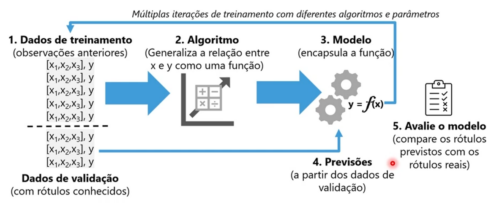
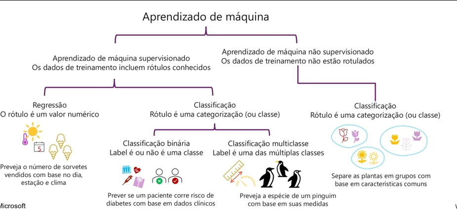
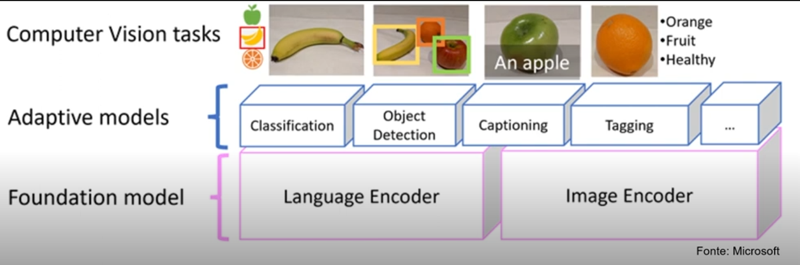
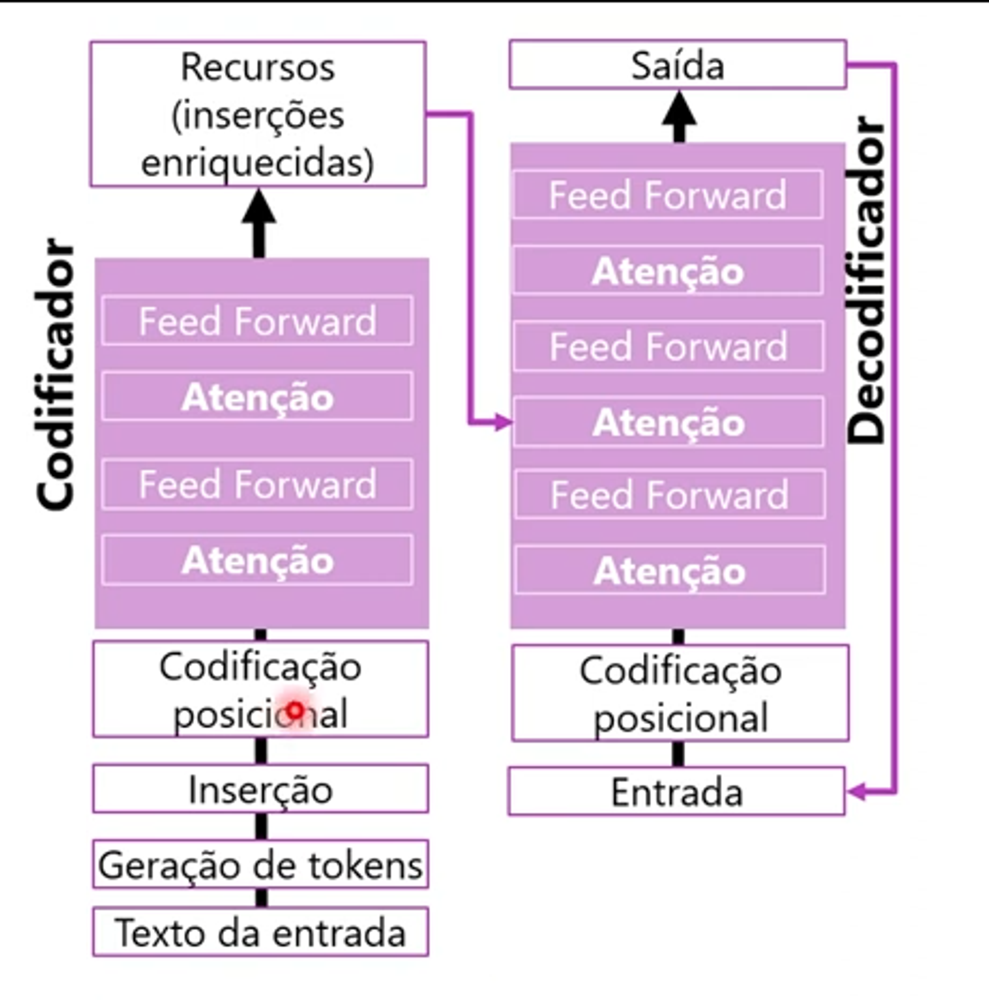

# Microsoft Azure AI Fundamentals - notes
*Minhas anotações do bootcamp "[Microsoft Azure AI Fundamentals](https://web.dio.me/track/microsoft-azure-ai-fundamentals)" da Dio.*

- Algumas funções da IA: prever resultados, reconhecer padrões, reconhecer eventos anormais, interpretar informações visuais.

## Cargas de trabalho
- **Machine Learning:** modelos preditivos baseados em dados e estatísticas (dados históricos);
- **Visão Computacional:** interpretar o mundo visualmente por meio de câmeras, vídeos e imagens;
- **Processamento de linguagem natural:** capacidade da IA interpretar a linguagem escrita ou falada e responder adequadamente(NPL, análise de sentimentos);
- **Inteligência de Documentos(doccument inteligence studio):** extrair e validar dados;
- **Mineração de conhecimento:** capacidade da ia para estrair informações de grandes volumes de dados (muitas vezes não estruturados);
- **IA Generativa:** cria conteúdo original em vários formatos, usando linguagem natural, imagens e códigos. Modelo de processamento usando a linguagem natural.

## Princípios de IA Responsável
- **Imparcialidade:** preconceito pode afetar os resultados. Por exemplo, um modelo de aprovação de empréstimos que discrimina por gênero;
- **Confiabilidade e segurança:** erros podem causar danos. Exemplo: um veículo autônomo sofre uma falha no sistema e causa uma colisão;
- **Privacidade e segurança:** dados privados podem ser expostos. Exemplo: um bot de diagnostico médico é treinado usando dados confidenciais.
- **Inclusão e transparência:** as soluções podem não funcionar para todos. Os usuários devem confiar em um sistema complexo;
- **Responsabilidade:** quem é responsável pelas decisões baseadas em IA?

## Fundamentos do aprendizado de máquina
- Modelo preditivo;
- **Aprendizado profundo:** rede neural artificial tenta copiar a rede neural humana. Cada “neurônio” é uma função que opera com um valor de entrada x e um peso w.
- Azure Machine Learning é a plataforma para aprendizado de máquina: [https://ml.azure.com](https://ml.azure.com)

*Fonte: Microsoft*

*Fonte: Microsoft*

## Visão Computacional → Azure AI Vision
- Uma imagem é uma matriz de valores de pixels;
- Organização do conteúdo, extração de texto, análise espacial;
- **Modelos multimodais:** modelo encapsula relações semânticas entre recursos extraídos das imagens. Pode ser usado como modelo base para modelos mais especializados.

*Fonte: Microsoft*

Redes neurais convolucionais:
1. As imagens são rotuladas para treinar o modelo;
2. Extrai da imagem cada pixel, cada recurso, cada ponto de foco e cria camadas de filtro;
3. Esse mapeamento de recurso é reunido;
4. Os valores desses recursos vão para a rede neural;
5. A camada de saída produz um valor de probabilidade para cada rótulo de classe.

*No Azure, primeiro cria o storage account e depois o storage blob, que serve como repositório para reunir as informações.*

## Azure Language Studio
- Detecção de idioma
- NER: Reconhecimento de Entidade Nomeada
- Detecção de PII e PHI
- Análise de Sentimentos
- Fala
    - Texto para fala
    - Conversão de fala para texto
    - Tradução de fala
- Tradução
    - Texto, documentos e personalizada
- Serviço de bot
    - Plataforma em nuvem para desenvolver e gerenciar bots
    - Integração com AI Languae
    - Conectividade através de vários canais
    - Compreensão da linguagem coloquial
- Análise semântica de texto (sentimento). Ajuda na interpretação de mensagens. Exemplo: serviço para reconhecer comentários de feedbacks
- Labs:
    - Estúdio de fala: [https://aka.ms/ai900-speech](https://aka.ms/ai900-speech)
    - Language Studio: [https://aka.ms/ai900-text-analysis](https://aka.ms/ai900-text-analysis)

## Inteligência de documentos
- Document Intelligence: extrai informações de formulários digitalizados em formato de imagem ou pdf
- Análise de documentos:
    - Retorna representações de dados estruturados
    - Regiões de interesse e relacionamentos
- Exemplos de uso: processo judicial
- Modelos: faturas, recibos, identificado, reconhecimento e extração de valores-chave
- Tamanho do arquivo precisa ser inferior a 50mb
- Extensões: jpeg, png, pdf, bmp, tif
- Para modelos personalizados:
    - Treine modelos com pelo menos 5 dados de amostra
    - Identifique campos de interesse
    - Os modelos realizam reconhecimento semântico de campos de formulário, e não apenas extração de texto

## Mineração de conhecimento
- Organizações tem muito conteúdo = Azure Cognitive Search
- Ingestão de dados:
    - Azure Blob Storage containers
    - Azure Data Lake Storage Gen2
    - Azure Table Storage
- Enriquecimento e índice de IA
    - Permite uma compreensão mais profunda
    - Visão, LPN, etc
    - Indexação torna o conteúdo pesquisável
- Explorar
    - Pesquisa realizada em índices
    - Dentro dos app
    - criar visualizações de dados
- Enriquecimento de IA
    - Reconhecer entidades no texto
    - Traduzir texto
- Avaliação de sentimento
- Lab: [https://aka.ms/ai900-ai-search](https://aka.ms/ai900-ai-search)

### Exemplo de criação de um search service no Azure:
- Azure AI Search: clicar em “Create search service”.
- Criar um serviço do tipo "AI Search".
- Criar um recurso para o Azure AI service.
- Criar uma conta de armazenamento (storage account).
- Quando criar o storage, liberar o acesso anónimo de Blob (Configuration → Allow Blob anonymous access → Enabled).
- No storage, criar um container com acesso “anonymous read access for containers and blobs”.
- No container criado, clicar em “Upload” e fazer o upload dos arquivos usados como teste.
- Agora que temos os documentos no storage, podemos usar o AI Search para extrair insights  deles. Para tal, acessar o AI Serach criado anteriormente e ir na opção “import data”. 
- Na aba “Connect to your data”, selecionar o nosso storage que contém as reviews que serão processadas.
- As demais abas servem para criar o skillset, index e indexador do serviço, que praticamente vai rodar o pipeline e extrair os campos de metadados do documento e o conteúdo do data source, gerar o skillset cognitivo para gerar conteúdo mais enriquecido, mapeando eles para um index.
- Após finalizado, é possível fazer queries para extrair o conteúdo do nosso data source.

*A estratégia consiste em  criar um serviço de IA que faz um link com a automação direcionando ela para um repositório*

## Fundamentos da IA Generativa
- Tentativa de imitar o comportamento humano usando aprendizado de máquina para interagir com o ambiente e executar tarefas sem instruções explícitas sobre o que gerar.
- Usado para: geração de linguagem natural, geração de código, geração de imagem, etc
- Modelos de linguagem grandes(LLMs): tipo especializado de modelo de machine learnign uqe pode usar para executar tarefas de PLN:
    - determinar sentimento ou classificar o texto em idioma natural
    - resumir um texto
    - comparar várias fontes de texto
    - geração de nova linguagem natural
        - Transformador: arquitetura consiste em dois componentes;
            - **Bloco codificador:** cria representações semânticas do vocabulário de treinamento
            - **Bloco decodificador:** gera novas sequências de linguagem
        - O texto é tokenizado para que cada palavra seja representada por um token numérico
        - No bloco decodificador, essas relações são usadas para prever a sequência mais provável de tokens
    - Tokenização: primeira etapa no treinamento de um modelo transformador é decompor o texto (particionar)
    - Inserções: são as relações entre tokens capturadas como vetores.
    - Atenção: captura a força das relações entre tokens
- Copilotos: fornecem uma maneira para os usuários obterem ajuda com tarefas comuns a partir de um modelo generativo de IA.

*Fonte: Microsoft*

### Conceitos OpenAI do Azure
- Solução de nuvem da microsoft para implantar, personalizar e hospedar modelos de linguagem grandes. Consiste em:
    - modelos de IA generativa predefinidos
    - funcionalidades de personalização
    - segurança corporativa com RBAC e redes privadas

- Pode ser usado de vários métodos:

    - estúdio de IA do Azure
    - API REST
    - SDKs com suporte e CLI do Azure

- Exemplo de modelos prédefinidos: GPT-4, GPT-3.5, Embeddings e DALL-E
- Funcionalidades da linguagem natural do OpenAI
    - os modelos GPT são excelentes para entender e criar linguagem natural
- Planejar IA generativa responsável
- As 4 fases do processo: identificar, medida, mitigar, operar
- Microsoft Coplilot: [https://copilot.microsoft.com/](https://copilot.microsoft.com/)

---

### Fontes:
- [Microsoft Azure AI Fundamentals](https://web.dio.me/track/microsoft-azure-ai-fundamentals) na Dio.
- [Explore an Azure AI Search index](https://aka.ms/ai900-ai-search)
- [Detect faces in Vision Studio](https://aka.ms/ai900-face)
- [Read text in Vision Studio](https://aka.ms/ai900-ocr)
- [Analyze images in Vision Studio](https://aka.ms/ai900-image-analysis)
- [Explore Speech Studio](https://aka.ms/ai900-speech)
- [Analyze text with Language Studio](https://aka.ms/ai900-text-analysis)
